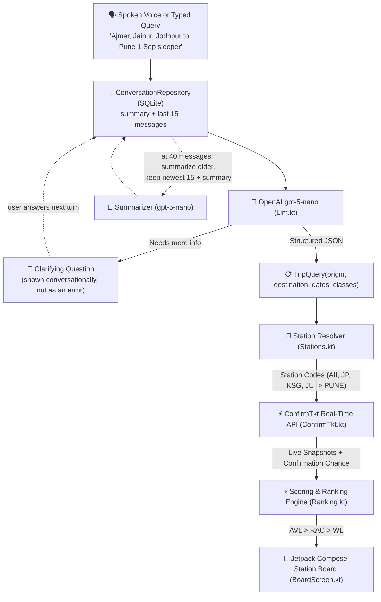

<div align="center">

# 🚆 AI Train Search

### **Autonomous AI-Powered Indian Railways Train Search & Availability Companion**

[](https://developer.android.com)
[](https://kotlinlang.org)
[](https://developer.android.com/jetpack/compose)
[](https://openai.com)
[](LICENSE)

---


<p align="center">
  <b>Search Indian Railways trains in plain conversational English, Hindi, or Hinglish.</b><br/>
  Combines natural language AI parsing with real-time seat availability scoring across multi-station origin & destination groups.
</p>

</div>

---

## 🌟 Key Features

- 🎙️ **Native Speech-to-Text (Hindi & English)**: Speak trip requests in Hindi (*"जोधपुर से पुणे 1 सितंबर स्लीपर"*) or English (*"Jaipur to Pune tomorrow"*). Powered by Android SpeechRecognizer with extended silence tolerance, tuned so a natural mid-sentence pause doesn't cut it off early.
- 🤖 **Smart LLM Intent Parser**: Uses `gpt-5-nano` — chosen for structured intent extraction and multi-turn grounding rather than open-ended reasoning — to extract travel dates, classes, and station groups from natural conversation in English, Devanagari Hindi, or Hinglish.
- 💬 **Conversational Follow-Ups, Not Errors**: If a trip is missing an origin, destination, or date, the agent asks a short clarifying question instead of failing — in the same language you've been using — and remembers your answer on the next turn.
- 🧠 **Persistent Conversation Memory**: Every exchange is stored on-device in a local SQLite database, so the app remembers you across restarts. Once the conversation grows past 40 messages, older turns are folded into a short rolling summary of your usual routes, classes, and habits — keeping only the most recent 15 raw turns plus that summary, so every LLM call stays small and cheap. A conversation left untouched for 30+ days is summarized once more and cleared, so the app never grows without bound.
- 🕘 **History Glance**: A small floating badge opens a read-only look back at the current summary and recent messages — no editing, no clutter, just a quick check of what was said.
- 🔀 **Multi-Source & Multi-Destination Expansion**: Express complex multi-station queries (*"Ajmer, Jaipur, Kishangarh, Jodhpur to Pune"*). Automatically resolves station codes (`AII`, `JP`, `KSG`, `JU` $\rightarrow$ `PUNE`).
- 📊 **Confirmation-Chance Prediction**: Waitlisted (`WL`) results show ConfirmTkt's own confirmation-chance percentage, color-coded from confident green to unlikely red.
- 🎨 **Station Board Card UI**: Classic dark railway station board theme with status pill badges (**AVL Green**, **RAC Amber**, **WL Red**), prominent `JU ➔ PUNE` route typography, and greyed-out train numbers.
- 🎛️ **Floating Filter & Sort Bar**: Instant multi-dimensional filtering by Rank, Date, Class (`SL`, `3A`, `3E`, `2A`, `1A`), and Availability status (`AVL`, `RAC`, `WL`).
- 🪵 **On-Device Diagnostics**: A flat log file plus a global crash handler capture failures locally, so nothing crashes silently and issues can be traced after the fact — the log never leaves the device.
- 🔒 **Privacy-First & Read-Only**: Pure search and availability analytics. Never performs transactions, stores personal identity, or requires login details. All conversation history and logs stay in local on-device storage only.

---

## 📸 Interface Showcase

<div align="center">

| Search Results Board | Station Route Typography | Filter Chips |
| :---: | :---: | :---: |
|  |  |  |

</div>

---

## ⚙️ Architecture & Data Flow



---

## 🚀 Getting Started

### Prerequisites
- **Android Studio**: Jellyfish (2024.1.1) or newer
- **JDK**: Java 21 (`openjdk@21`)
- **Android Device**: Android 8.0 (API 26) or higher

### Building & Running
1. **Clone the Repository**:
   ```bash
   git clone https://github.com/jamil225/ai-train-search.git
   cd ai-train-search/TrainSearch
   ```

2. **Run Unit Tests**:
   ```bash
   ./gradlew :app:testDebugUnitTest
   ```

3. **Install Debug Build on Phone**:
   ```bash
   ./gradlew :app:installDebug
   ```

---

## 🛡️ Security & Privacy

This application is strictly **read-only** and uses official public endpoints to query live train availability.
- No payment or booking functionality.
- No passenger details or identity collection.
- API keys are stored locally on-device using Android `SharedPreferences` and are never committed to git.
- Conversation history and the rolling summary live only in a local, on-device SQLite database — never uploaded or synced anywhere. It automatically clears itself after 30 days of inactivity.
- Diagnostic logs are written to a single flat file on-device (capped at ~512KB) purely for local troubleshooting; nothing is transmitted off the device.
