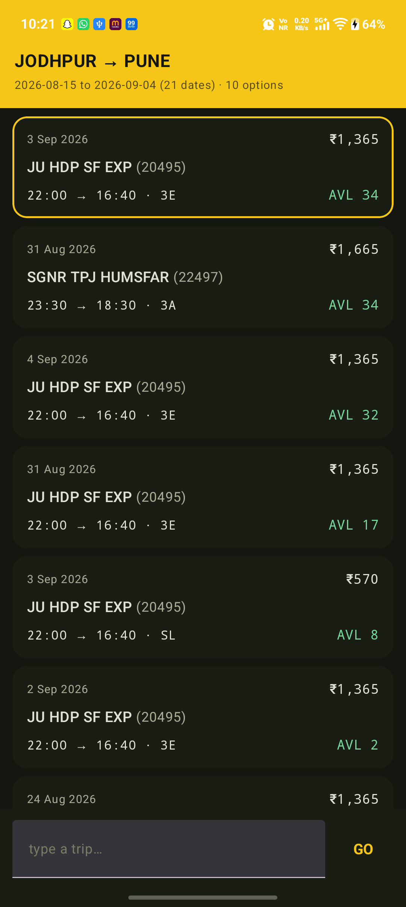
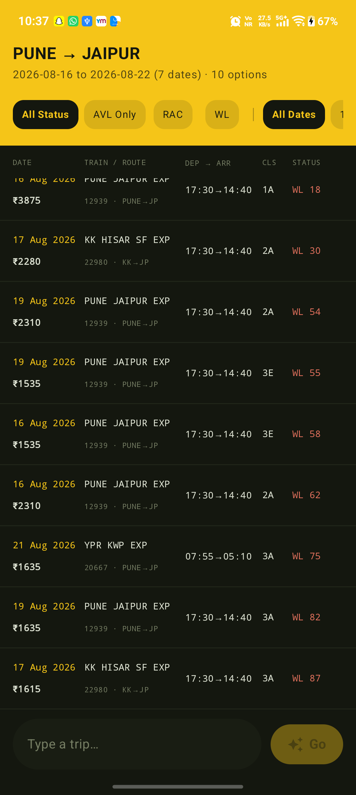
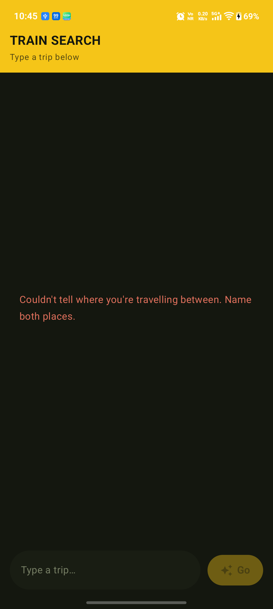
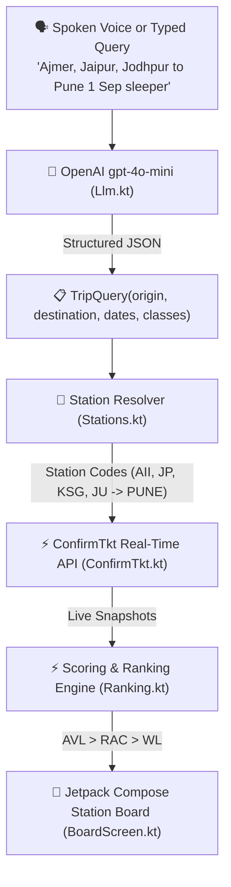

<div align="center">

# 🚆 AI Train Search

### **Autonomous AI-Powered Indian Railways Train Search & Availability Companion**

[](https://developer.android.com)
[](https://kotlinlang.org)
[](https://developer.android.com/jetpack/compose)
[](https://openai.com)
[](LICENSE)

---


<p align="center">
  <b>Search Indian Railways trains in plain conversational English, Hindi, or Hinglish.</b><br/>
  Combines natural language AI parsing with real-time seat availability scoring across multi-station origin & destination groups.
</p>

</div>

---

## 🌟 Key Features

- 🎙️ **Native Speech-to-Text (Hindi & English)**: Speak trip requests in Hindi (*"जोधपुर से पुणे 1 सितंबर स्लीपर"*) or English (*"Jaipur to Pune tomorrow"*). Powered by Android SpeechRecognizer with extended silence tolerance.
- 🔀 **Multi-Source & Multi-Destination Expansion**: Express complex multi-station queries (*"Ajmer, Jaipur, Kishangarh, Jodhpur to Pune"*). Automatically resolves station codes (`AII`, `JP`, `KSG`, `JU` $\rightarrow$ `PUNE`).
- 🤖 **Smart LLM Intent Parser**: Uses `gpt-4o-mini` to extract travel dates, classes, and station groups from natural conversation in English, Devanagari Hindi, or Hinglish.
- 🎨 **Station Board Card UI**: Classic dark railway station board theme with status pill badges (**AVL Green**, **RAC Amber**, **WL Red**), prominent `JU ➔ PUNE` route typography, and greyed-out train numbers.
- 🎛️ **Floating Filter & Sort Bar**: Instant multi-dimensional filtering by Rank, Date, Class (`SL`, `3A`, `3E`, `2A`, `1A`), and Availability status (`AVL`, `RAC`, `WL`).
- 🕒 **Non-Blocking Search History Suggestions**: Inline Compose history suggestions container providing one-tap query re-execution without interrupting soft keyboard focus.
- 🔒 **Privacy-First & Read-Only**: Pure search and availability analytics. Never performs transactions, stores personal identity, or requires login details.

---

## 📸 Interface Showcase

<div align="center">

| Search Results Board | Station Route Typography | Filter Chips |
| :---: | :---: | :---: |
|  |  |  |

</div>

---

## ⚙️ Architecture & Data Flow



---

## 🚀 Getting Started

### Prerequisites
- **Android Studio**: Jellyfish (2024.1.1) or newer
- **JDK**: Java 21 (`openjdk@21`)
- **Android Device**: Android 8.0 (API 26) or higher

### Building & Running
1. **Clone the Repository**:
   ```bash
   git clone https://github.com/jamil225/ai-train-search.git
   cd ai-train-search/TrainSearch
   ```

2. **Run Unit Tests**:
   ```bash
   ./gradlew :app:testDebugUnitTest
   ```

3. **Install Debug Build on Phone**:
   ```bash
   ./gradlew :app:installDebug
   ```

---

## 🛡️ Security & Privacy

This application is strictly **read-only** and uses official public endpoints to query live train availability.
- No payment or booking functionality.
- No passenger details or identity collection.
- API keys are stored locally on-device using Android `SharedPreferences` and are never committed to git.
