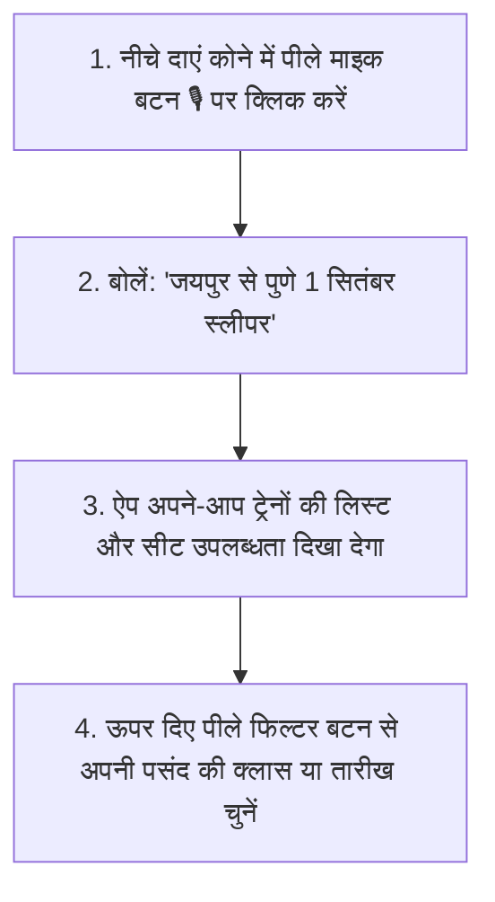

# 🙏 AI Train Search (एआई ट्रेन सर्च) — परिवार के लिए आसान इस्तेमाल गाइड

यह ऐप आपकी ट्रेन यात्रा खोजने और सीटों की उपलब्धता देखने को बहुत आसान और सुविधाजनक बनाता है। आप बिना टाइप किए **हिंदी में बोलकर** भी ट्रेन खोज सकते हैं!

---

## ⭐ मुख्य विशेषताएं (Core Features)

1. 🎙️ **बोलकर खोजें (Voice Search)**: टाइप करने की जरूरत नहीं — बस माइक बटन दबाएं और हिंदी या इंग्लिश में बोलें!
2. 🏙️ **एक साथ कई शहरों से ट्रेनें देखें**: जैसे *"अजमेर, जयपुर, जोधपुर से पुणे"*।
3. 🚦 **रंगों से सीटों की जानकारी**: 
   - 🟢 **हरा रंग**: सीट कन्फर्म (Available) है।
   - 🟡 **पीला रंग**: RAC (हाफ सीट) है।
   - 🔴 **लाल रंग**: वेटलिस्ट (WL) है।
4. 🎛️ **स्मार्ट फिल्टर**: अपनी मनपसंद क्लास (`SL`, `3A`, `2A`), तारीख या केवल उपलब्ध (Confirmed) सीटें एक क्लिक में देखें।

---

## 📱 स्टेप-बाय-स्टेप इस्तेमाल करने का तरीका

### 🎙️ तरीका 1: बोलकर ट्रेन खोजें (सबसे आसान तरीका)

1. **माइक बटन दबाएं**:
   - स्क्रीन पर **सबसे नीचे** काले रंग की पट्टी में देखें।
   - दाहिने तरफ बने **पीले रंग के "Go" बटन** के ठीक बाईं (Left) तरफ **पीले रंग का माइक का निशान (`🎙️`)** दिखेगा।
   - इस माइक बटन (`🎙️`) को एक बार छुएं (Click करें)।
2. **अपनी यात्रा बोलें**:
   - मोबाइल स्क्रीन पर गूगल का सुनने वाला पॉप-अप दिखाई देगा।
   - आराम से हिंदी में बोलें, जैसे:
     - *"जयपुर से पुणे 1 सितंबर स्लीपर"*
     - *"अजमेर या जोधपुर से पुणे कल"*
     - *"जोधपुर से मुंबई थर्ड एसी"*
3. **खुद-ब-खुद रिजल्ट दिखेगा**:
   - आपके बोलने के तुरंत बाद ऐप ट्रेनों की सूची और सीटों की लाइव जानकारी दिखा देगा!

---

### ⌨️ तरीका 2: टाइप करके खोजें

1. स्क्रीन के **सबसे नीचे** बने गोल टाइपिंग बॉक्स (Text Box) पर छुएं।
2. कीबोर्ड खुलेगा, उसमें अपनी यात्रा लिखें (जैसे *"Jaipur to Pune tomorrow"* या *"Rajasthan to Pune 1 Sep"*)।
3. टाइप करने के बाद नीचे दाहिने कोने में बने **पीले रंग के "Go" बटन** को दबाएं।
4. 🕒 **पुरानी खोजें दोबारा देखने के लिए**: टाइपिंग बॉक्स के अंदर बने **घड़ी वाले बटन (`🕒`)** पर क्लिक करें। आपकी पुरानी खोजी गई यात्राओं की सूची आ जाएगी, जिस पर क्लिक करके आप दोबारा खोज सकते हैं।

---

## 🎫 ट्रेन कार्ड (रिजल्ट) कैसे समझें?

प्रत्येक ट्रेन का कार्ड नीचे दिए गए तरीके से दिखाई देता है:

1. **ऊपरी पट्टी (Top Line)**:
   - बाईं तरफ काली पट्टी में यात्रा की तारीख (जैसे `1 Sep 2026`) और दाहिनी तरफ टिकट का किराया (जैसे `₹1,365`)।
2. **मुख्य लाइन (Middle Line - सबसे जरूरी)**:
   - पीले रंग के बड़े अक्षरों में **शुरुआती और आखिरी स्टेशन** दिखाई देगा: **`JU ➔ PUNE`** और बगल में ट्रेन नंबर `(20495)`।
3. **ट्रेन का नाम**:
   - सफेद अक्षरों में ट्रेन का नाम (जैसे `JU HDP SF EXP` — जोधपुर पुणे एक्सप्रेस)।
4. **समय और क्लास**:
   - छूटने का समय $\rightarrow$ पहुंचने का समय और क्लास (जैसे `22:00 → 16:40 · SL`)।
5. **सीट की स्थिति (दाएं कोने में गोल कैप्सूल/बटन)**:
   - 🟢 **AVL 35 (हरा बटन)**: 35 सीटें उपलब्ध और कन्फर्म हैं!
   - 🟡 **RAC 4 (पीला बटन)**: RAC में 4 नंबर पर है।
   - 🔴 **WL 12 (लाल बटन)**: वेटलिस्ट में 12 नंबर पर है।

---

## 🎛️ फिल्टर (Filters) का इस्तेमाल कैसे करें?

स्क्रीन पर **सबसे ऊपर** पीले रंग की पट्टी (Header Bar) में गोल बटन दिए गए हैं, जिन्हें छूकर आप लिस्ट को अपनी पसंद के अनुसार छोटा कर सकते हैं:

1. ⚡ **Rank / 📅 Date**: 
   - **Rank**: सबसे बढ़िया और सुविधाजनक ट्रेनों को ऊपर देखने के लिए।
   - **Date**: ट्रेनों को तारीख के क्रम से लगाने के लिए।
2. **All Classes / SL / 3A / 3E / 2A / 1A**:
   - अगर आप केवल **स्लीपर (SL)** ट्रेन देखना चाहते हैं, तो **`SL`** बटन पर क्लिक करें।
   - अगर आप केवल **थर्ड एसी** देखना चाहते हैं, तो **`3A`** पर क्लिक करें।
3. **AVL Only (केवल उपलब्ध सीटें)**:
   - अगर आप वेटलिस्ट या RAC ट्रेनें नहीं देखना चाहते और केवल वही ट्रेनें देखना चाहते हैं जिनमें सीटें कन्फर्म (हरी) हैं, तो **`AVL Only`** बटन पर क्लिक करें!
4. **All Dates / तारीख बटन**:
   - अगर आपने कई दिनों की खोज की है, तो अपनी मनपसंद तारीख वाले बटन पर क्लिक करके उसी दिन की ट्रेनें देख सकते हैं।

---

🔒 **ध्यान दें**: यह ऐप पूरी तरह सुरक्षित और केवल ट्रेन की जानकारी तथा सीट उपलब्धता देखने के लिए है। इससे कोई टिकट बुक या पैसे का लेनदेन नहीं होता है।
