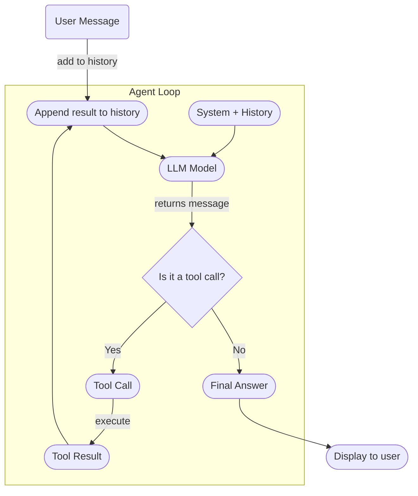
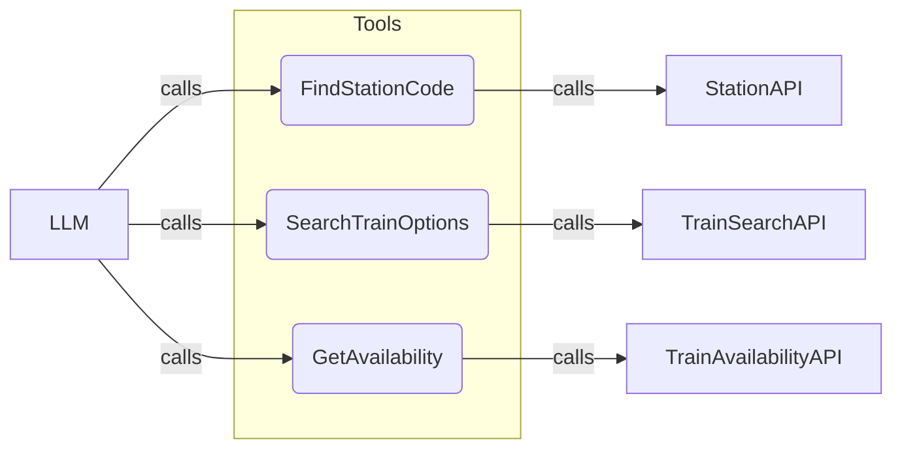

# Local Travel-Search Agent Android App – Research & Specification

**Executive Summary:** We will build a Kotlin/Jetpack Compose Android app that runs an LLM-based travel-search agent *entirely on-device*. There is **no custom backend** – the phone itself handles the agent loop and tool calls. On first launch, the user provides their own OpenAI API key (securely stored via Android Keystore) and (optionally) signs in with Google for identity. The app uses a fixed **toolset** (e.g. `search_train_options`, `find_station_code`, `get_seat_availability`) with hard-coded API endpoints. An LLM (via OpenAI’s Chat/Responses API) handles natural-language understanding and planning (function-calling). When a user says, for example, “I need to travel from Rajasthan to Pune on Sep 1,” the app parses the intent with the LLM, the Kotlin code deterministically expands “Rajasthan”/“Pune” into station lists (per your `AGENTS.md` priorities), calls the train APIs in parallel, ranks results by your rules, and then asks the LLM to format a friendly response. This architecture is proven feasible: Google’s new **ADK for Android** explicitly supports on-device agents with Kotlin tools, and OpenAI’s Java SDK supports function calls in Kotlin/Android. We will implement a simple ReAct-style loop in Kotlin rather than a heavy framework, minimizing overhead.  

Key pillars of this design include:

- **No Backend:** The app itself is the “server.” Tools are implemented as Kotlin functions, not arbitrary HTTP calls. We do *not* let the LLM fetch any URL except our fixed endpoints (no generic “httpRequest” tool).  
- **BYOK API Key:** The OpenAI key is *not* embedded in the APK. On first run, the user (e.g. you or your father) enters their own key. It is stored securely via Android’s Keystore. The key is never shown to the LLM or sent in prompts.  
- **Fixed Tools & Endpoints:** The only callable tools are those we register (see *Tool Schemas* below). Their endpoints/URLs are hard-coded in the Kotlin code (e.g. `https://api.confirmtkt.com/v2/rail/search`). This allowlists the API domains. Parameters are strongly typed Kotlin data classes, not raw JSON, ensuring validity.  
- **LLM as Interface Only:** The LLM’s job is to interpret user requests and decide which *registered* tool to call. It does *not* execute arbitrary code or switch endpoints. This maximizes safety and predictability.  
- **Phased Roadmap:** Phase 1 (text chat) and Phase 2 (voice input) are separated for minimal friction. Phase 1 is a working MVP; Phase 2 adds speech recognition (Android’s `SpeechRecognizer` or Gboard voice typing). We explicitly avoid third-party speech-to-text APIs (like Wispr) in Phase 2, using Android’s native capabilities. We will defer any conversational voice output (OpenAI Realtime audio) to a later phase if needed.

The rest of this document details the architecture, requirements, and plans.

---

## Product Goals & Constraints

- **User story:** A traveler can simply **type or say** “I want to go from Rajasthan to Pune on Sep 1.” The app automatically finds relevant train routes, checks availability and fares, and returns the best options in a clear format. The user doesn’t need to know station codes or train numbers – the LLM interface handles translation and presentation.  
- **No Backend:** All logic runs in the app. Aside from calls to the train APIs and the OpenAI API, no custom server or cloud function is used. The phone acts as the “agent host.” (This removes deployment hassle; only the user’s own OpenAI key is needed.)  
- **User-Provided AI Key:** On first use, the user will supply an OpenAI API key (or other LLM provider key). This complies with OpenAI’s guidance: *“Do not embed API keys in client apps”*. The app will never include a built-in key or call any private server.  
- **Limited Tools:** Only a small set of tools will be available to the agent, e.g.:
  - `find_station_code(location: String): List<String>` – looks up possible station codes for a city/region.  
  - `search_train_options(originCodes: List<String>, destCodes: List<String>, date: String, classes: List<String>): List<TrainOption>` – searches trains for each origin→destination code pair and returns aggregated options.  
  - `get_seat_availability(train: String, from: String, to: String, date: String): Availability` – checks seat availability (AVL/RAC/WL) for a specific train and segment.  
  These functions are implemented in Kotlin, using the fixed ConfirmTkt API URL under the hood. The model sees only the arguments, not the full URL.  
- **Phased Development:** 
  - *Phase 1 (Text Chat)*: The app has a Compose-based chat UI. The user types requests, the LLM plans the solution (via function calls), and results appear as formatted cards.  
  - *Phase 2 (Voice Input)*: We add a microphone button. Pressing it uses Android’s `SpeechRecognizer` (preferably on-device) to capture voice, transcribe to text, and send to the same chat pipeline. We rely on any voice-to-text keyboard (Gboard) as a fallback – no new APIs. The spoken input is shown in the text box for confirmation before sending.

---

## Architecture Overview

We adopt an agentic architecture entirely within the Android app. 

```mermaid
flowchart LR
  subgraph Android App
    U[User] --> UI[Chat UI (Compose)]
    UI --> A[Agent Loop (LLM Client)]
    A -- requests tool --> Tools[Tool Registry]
    Tools --> T1[find_station_code]
    Tools --> T2[search_train_options]
    Tools --> T3[get_seat_availability]
    T1 --> S[Station API]
    T2 --> API[Train Search API]
    T3 --> API
    API --> DB[Train API Responses]
    S --> DB
    DB --> Rank[Ranking Engine]
    Rank --> UI
  end
```

1. **User & UI:** The user interacts via a chat interface (Jetpack Compose). They type or speak their request. The UI displays messages and final train-results cards.  
2. **Agent Loop:** The app maintains a conversation history (as a list of messages). It sends this history (plus system prompt) to the OpenAI API (via the Java/Kotlin client). The LLM replies either with a final answer *or* with a *function call*. If it calls a tool, our code executes it and sends the result back into the conversation. This loop repeats until the LLM emits a final text answer. (This is a standard ReAct/Function-Calling loop.)  
3. **Tools:** We register a fixed set of tools (no more can be added at runtime). Each tool has a known signature:
   - *Example:* `SearchTrainOptionsRequest(origin: String, destination: String, date: String, classes: List<String>)` → returns `SearchTrainOptionsResult` with fields like train number, departure, arrival, class, availability, fare.  
   The OpenAI Java SDK can derive function definitions from Kotlin/Java classes (via JSON schema). So we define the tool classes (or data classes) in Kotlin and pass them to the SDK.  
   The agent **cannot** call arbitrary URLs or code – it only knows these predefined tools. This isolates security and prevents prompt injection.  
4. **API Calls:** Each tool implementation makes fixed HTTP calls. For example, `search_train_options` might generate pairs of station codes (per your Rajasthan/Pune groups), then use OkHttp/Retrofit to call `https://api.confirmtkt.com/v2/rail/search` (with our stored `apiKey`) for each pair in parallel (via coroutines). The raw JSON is parsed into Kotlin data classes. All network domains are static – no dynamic URL input from the model.  
5. **Ranking Engine:** Once raw results are gathered, a Kotlin module applies your custom ranking: prefer routes via Ajmer/Jaipur/etc. and SL>3A>2A, treat confirmed seats > RAC > WL, etc. (As per your `AGENTS.md` rules.) The top results are passed back to the agent or directly formatted in the UI.  
6. **Final Output:** The agent (LLM) generates a friendly summary or explanation of the results, but the UI *renders* the structured data (tables or cards), not the model. This separation ensures a polished UI (not raw text tables).  

Overall, the Android app graph above means: **Input → LLM → (maybe) Tool Calls → APIs → Ranking → LLM → Output**.

## Agent Loop Detail

**Mermaid Diagram – Agent Loop:**  

The loop works as follows:
1. Append the user’s new message to the conversation history.
2. Send the conversation (system prompt + history) to the LLM via the OpenAI API.  
3. If the LLM returns a normal assistant response (text), **stop** – we display it (and any structured results embedded in the UI).  
4. If the LLM returns a **tool call** (JSON with a function name and arguments), we validate the call, execute our Kotlin function, and append the result to history as a message of role `tool`.  
5. Repeat: send the updated conversation back to the LLM until it finally responds with non-tool content.  

This ReAct-style loop is well-established. For example, LangGraph4j’s `AgentExecutor` implements a similar cycle in Java. We will code a minimal version by hand in Kotlin. 

**Tool Registry Diagram:**  

This schematic shows that the LLM can only invoke the named tool functions we define. Each maps to a fixed API. The LLM sees only the function name and structured arguments.

## Detailed Requirements

### Phase 1 – Text Chat

- **Onboarding Flow:**
  - On first launch, show a simple form: “Enter your OpenAI API key” (secure input). Save to encrypted prefs/Keystore. Also optionally “Sign in with Google” for user ID (not strictly required for agent logic, but can be used to separate sessions). **Reference:** OpenAI warns against embedding keys in apps, so a user-entered key is mandatory.  
  - Optionally allow the user to switch API endpoints if needed (e.g. using a different train data provider later), but initially hard-code the ConfirmTkt URL.  
- **Chat UI:**
  - A Compose screen with a list of chat bubbles (user vs assistant) and an input box. Bubbles can be styled differently (user-right, agent-left).  
  - The assistant’s messages may include our custom train-result UI: e.g. a RecyclerView/Compose `Column` of result cards showing route, train details, class, availability, price, etc. (Under the hood, this is driven by the LLM indicating which result is *best* or by our ranker labeling them.)  
  - The bottom input has a text field and a “Send” button (for Phase 1).  
- **LLM Prompting:**
  - A **system prompt** initialized in code (not user-editable) instructs the agent: e.g. “You are a travel assistant that finds train routes. Use the provided tools exactly as described. Do NOT book tickets or do anything beyond searching and explaining results.” (Similar to `AGENTS.md` instructions).  
  - Include your location preferences in the system prompt: “For journeys from Rajasthan, prefer stations Ajmer, Kishangarh, Jaipur, Merta Road, Jodhpur. For Pune, prefer Pune and Khadki (and Mumbai terminals as last resort). Rank options by route convenience before seat availability.” These rules can be reiterated in the system prompt for clarity.  
- **Tool Schemas (Type Signatures):** We will register three Kotlin functions as tools. Example (pseudocode):
  ```kotlin
  data class SearchTrainOptionsRequest(
      val origin: String,   // e.g. "Rajasthan"
      val destination: String,
      val date: String,     // in YYYY-MM-DD
      val classPreferences: List<String>  // e.g. ["SL", "3A", "2A"]
  )
  data class TrainOption(
      val train: String,
      val route: String,
      val depart: String,
      val arrive: String,
      val travelTime: String,
      val className: String,
      val availability: String,
      val fare: Int
  )
  data class SearchTrainOptionsResult(val options: List<TrainOption>)
  
  data class FindStationCodeResult(val stations: List<String>)
  data class AvailabilityRequest(val train: String, val from: String, val to: String, val date: String)
  data class AvailabilityResult(val availability: String)
  ```
  We will register:
  - `search_train_options(SearchTrainOptionsRequest): SearchTrainOptionsResult`
  - `find_station_code(String): FindStationCodeResult`
  - `get_seat_availability(AvailabilityRequest): AvailabilityResult`
  The OpenAI Java/Kotlin SDK can introspect these classes (using JSON Schema) to inform the LLM of each tool’s parameters. (This matches how the SDK docs show Java classes as functions.)  
- **Example Flow (Text):**  
  - User: *“Rajasthan to Pune on Sep 1, sleeper class”*  
  - LLM (assistant role): tool call `find_station_code("Rajasthan")`.  
  - (App calls Station API or local mapping; returns e.g. `["AII","KSG","JP","MTD","JU"]`.)  
  - Append tool response and re-run LLM: tool call `find_station_code("Pune")`.  
  - (Return `["PUNE","KK","BDTS","MMCT","DR","LTT","CSMT","PNVL"]`.)  
  - LLM then calls `search_train_options({origin:"Rajasthan",destination:"Pune",date:"2026-09-01",classes:["SL"]})`.  
  - (App splits into all pairs of stations, runs APIs, collects trains – e.g. a list of trains and times, with availability – and returns top ~10 options in `SearchTrainOptionsResult`.)  
  - LLM sees the JSON list of options, picks the best one or two, and returns a natural-language answer like *“The best sleeper option is Train 12940 from Ajmer (AII) to Pune, departing 18:30 and arriving 08:40, with 24 available seats. Here are a few more options…”*, possibly with enumerated details.  
  - The UI then presents those options as styled cards.  

This ensures the LLM is never manually iterating over all station codes or API calls – the Kotlin code handles the heavy lifting once the broad parameters are set.

### Phase 2 – Voice Input

- **Speech-to-Text Integration:** We will add a microphone button next to the chat input. Pressing it will start Android’s `SpeechRecognizer` to capture audio. Preferably, we use the on-device engine (Gemini Nano on Pixel, Google Speech on others) by setting `EXTRA_PREFER_OFFLINE` for `Intent(RecognizerIntent.ACTION_RECOGNIZE_SPEECH)`. In practice, users must enable Google’s offline voice typing in settings to use it without Internet.  
  - As fallback, Gboard’s voice input will work automatically (the text field can accept dictated text from the keyboard, since Gboard inserts recognized speech as input).  
  - We show the partial transcript in the text box in real time. The user can tap **Stop** or wait for auto-stop, then edit/correct the text if needed, and press **Send**.  
  - The rest of the flow is identical: the transcribed text is treated as a user message to the agent.  
- **UX Considerations:** 
  - The chat input box might show a microphone icon (🎙️) on the right when empty. While listening, show an animated recording indicator.  
  - Ensure all prompts and messages are still in English/Hindi as needed (the speech recognizer will use the device’s default locale).  
  - Do **not** use any external speech-to-text API. The requirement was no extra APIs, and Android’s built-in service suffices.  
  - Keep responses in the UI as text (voice output is beyond Phase 2, but could be added later with, e.g., Android TTS or OpenAI’s audio).

### Security & Guardrails

We treat the LLM as an **untrusted planner** and build strict barriers around it:

- **Restricted Tools Only:** The LLM’s only capabilities are the tools we explicitly register. We **do not** expose any HTTP client, shell, or generic `execute_code()` function to the model. This prevents the model from fetching malicious URLs or running arbitrary code.  
- **Allowlisted Endpoints:** Each tool function uses a fixed URL (e.g. `api.confirmtkt.com`). We never allow the model to modify the hostname or path. For example, our `searchTrains` code might look like:  
  ```kotlin
  val base = "https://api.confirmtkt.com/v2/rail/search"
  client.get("$base") { ... } 
  ```  
  There is no user-controlled URL parameter. Android’s Network Security Config or host verify can further enforce this if needed.  
- **Typed Parameters:** We use Kotlin data classes with specific fields (e.g. `origin: String`). We validate inputs: for instance, require `origin` to be one of a known set of location strings. If the LLM attempts an invalid tool call (e.g. an unsupported function name or non-string argument), we ignore or error it out.  
- **No Key or Secret Leakage:** The user’s API key is never passed into the prompt or model. Only the OpenAI client code uses the key to sign requests to OpenAI’s servers. Similarly, the train API credentials (if any) stay in code/Keystore and never appear in text.  
- **Rate Limits & Timeouts:** We will enforce sensible limits. For example, if `search_train_options` would generate many API calls, we cap it (e.g. max 20 station pairs, 30 seconds timeout, 3 retries). The agent loop also has a maximum number of iterations (e.g. 5–7 turns) to prevent infinite loops or runaway usage.  
- **Immutability:** The tool registry is fixed at startup and never changed at runtime. The LLM cannot register new tools. Our code does not evaluate any dynamic code from the model.  
- **Treat Tool Output as Data:** Any strings returned from the train API (train names, station names) are treated purely as data. The system prompt should instruct the LLM *not* to follow any instructions contained in user or tool texts. (For example, if a train name somehow contained malicious text, we must not execute it.)  
- **User-Initiated Actions Only:** We will not build booking or payment tools in the initial app. Even if we did in the future, booking would require an explicit user confirmation screen (human-in-the-loop). No tool performs irreversible actions silently.  
- **Secure Storage:** Store the API key in EncryptedSharedPreferences or Keystore. Warn users not to share screenshots of the app containing their key. (This is mostly a documentation note – secure UI and Android best practices apply.)

These guardrails ensure the LLM can *only* execute the intended search logic, mirroring the design in your conversation. The emphasis is on *least privilege* – the LLM never gets arbitrary code execution.

## Testing & Spike Plan

Before full implementation, we will validate our approach with several spikes:

| Spike Task                            | Purpose                                                                | Success Criteria                  |
|---------------------------------------|------------------------------------------------------------------------|-----------------------------------|
| **OpenAI Java SDK on Android**        | Integrate the [OpenAI Java client](https://github.com/openai/openai-java) into a fresh Android app. Test function-calling with a toy tool. | Can successfully call `client.chat().completions()` or `responses()` with a dummy `@Tool` class and handle a tool call reply. |
| **Manual ReAct Loop POC**             | Write a minimal Kotlin agent loop (send prompt, handle toolCall) using the SDK. Use local console UI. | LLM responds with a function call JSON; Kotlin parses it, executes dummy code, returns result; LLM then finishes. |
| **API Client (OkHttp) Fallback**      | If the SDK proves incompatible, try making direct HTTP calls with OkHttp/Ktor to the OpenAI API (Responses endpoint) from Android. | Successfully call OpenAI API by manually serializing JSON and reading the function call response. |
| **Google ADK Proof-of-Concept**       | Build a tiny ADK-based app (per [Android ADK docs](https://developer.android.com/ai/adk)) with one annotated tool, using `InMemoryRunner`. | ADK agent can be invoked in the Android app and returns expected results. (We do *not* have to use ADK in final product, but this confirms viability.) |
| **LangGraph4j Study**                 | Review LangGraph4j’s example (it has a built-in ReAct `AgentExecutor`). Try to run their example on desktop. | Understand how LangGraph4j wires up tools via annotations and agent loop – use it as a reference for our own loop. |
| **LangChain4j Survey**                | Inspect LangChain4j’s agentic API (docs) and examples for Kotlin usage. | Identify patterns that could simplify our code (but likely we implement manually). |
| **SpeechRecognizer Quick Test**       | On a target device, enable “Offline speech recognition” and try a quick Kotlin `SpeechRecognizer` snippet. | Verify that it can transcribe simple speech on-device. (E.g. “hello world” => “hello world”.) |

Each spike has clear exit criteria. We prioritize the first two to ensure the core agent loop works. The ADK spike is lower priority (it’s for reference, since our plan is to code manually, but it’s useful to see Google’s approach). References such as the ADK blog and the developer docs will guide any ADK experiments.

## Implementation Checklist

Below is a high-level task list for Phase 1 (text chat) and Phase 2 (voice):

| Task                                   | Done? | Notes / References                                                 |
|----------------------------------------|:-----:|--------------------------------------------------------------------|
| **Project Setup:** Create new Android (Kotlin) project, add Compose and Coroutines. | [ ]  | Configure `minSdk24+`, include dependencies (OpenAI SDK or HTTP client). |
| **LLM Client:** Integrate OpenAI Java/Kotlin client (or OkHttp) and test a simple chat request. | [ ]  | Use `<OpenAIClient>` with `fromEnv()` or `OpenAIConfig(apiKey)`. |
| **Tool Classes:** Define Kotlin data classes for tools (with names matching intended calls). | [ ]  | Example tools: `SearchTrainOptionsRequest`, `TrainOption`, `FindStationCodeResult`, etc. |
| **Agent Loop:** Implement loop logic: send message, check for tool call, execute, send result. | [ ]  | Use `response.getChoices().get(0).getMessage().getToolCalls()` or SDK stream methods as in . |
| **Tools Implementation:** Write functions:  
`findStationCode(String): List<String>` – use a lookup table or API.  
`searchTrainOptions(SearchTrainOptionsRequest): List<TrainOption>` – call ConfirmTkt API (parallel coroutines), parse JSON.  
`getSeatAvailability(AvailabilityRequest): String` – call seat API. | [ ]  | Use Retrofit/OkHttp. Handle JSON via Kotlin serialization or Moshi. Return domain objects. |
| **Ranking Engine:** Code your ranking rules (stations priority, class/avail hierarchy). Sort the results from `searchTrainOptions` accordingly. | [ ]  | Follow the logic in `AGENTS.md`. E.g. always sort by convenience (station index) then class then availability. |
| **UI – Chat Screen:** Build Compose UI: message list + input field + send button. Style user vs assistant bubbles. | [ ]  | No complex UI needed; focus on functionality. |
| **UI – Train Results:** Design a reusable component (card or table) for displaying a `TrainOption` nicely (route, times, class, fare). | [ ]  | This is done client-side; the LLM only needs to label which is “best” etc. |
| **System Prompt:** Encode initial instructions (tools usage, preferences, no booking, etc.) in a string. Include station prefs as bullet points or prose. | [ ]  | Refer to your `AGENTS.md` for exact rules to include. |
| **First-Run Key Entry:** Create a simple screen/dialog to input the OpenAI API key. Store it encrypted (AndroidX Security). | [ ]  | The key is later loaded for the OpenAI client. |
| **Security Checks:** Implement basic validation in the tool executor: confirm function name is expected, arguments have correct types/values. Enforce max calls/timeout. | [ ]  | For example, if LLM asks `sleep(0,10)`, reject it. |
| **Error Handling:** Handle API failures gracefully (retry or show error to user). If the LLM loop errors out, reset it and show a message. | [ ]  | Timeouts, rate-limits from ConfirmTkt should not crash the app. |
| **Testing – Unit:** Create unit tests for each tool function (mock API responses). | [ ]  | E.g. given fixed API JSON, does `searchTrainOptions` parse and rank correctly? |
| **Testing – Integration:** Simulate a full conversation. E.g., feed “Jaipur to Pune tomorrow” and verify the agent finds matching trains. | [ ]  | Could use a test harness or hardcoded stub. |
| **UX Polish:** Ensure input box is scrollable, keyboard auto-focus, chat scrolls to bottom, etc. | [ ]  | This is standard Compose work. |
| **Phase 2 – Mic UI:** Add a mic icon button. On press: start listening with `SpeechRecognizer`. Show “Listening…” indicator. Convert result to text and put in input field. | [ ]  | Use `RecognizerIntent` with `EXTRA_PREFER_OFFLINE`. |
| **Permissions:** Request `RECORD_AUDIO` permission as needed. Explain to user (privacy). | [ ]  | Android 13+: use `ActivityResultLauncher` for permission. |
| **Voice Confirmation:** Allow editing the recognized text before sending (don’t auto-send raw). | [ ]  | This prevents accidental queries. |
| **Phase 2 Testing:** Try voice queries in different accents/languages. Ensure the same agent loop handles them. | [ ]  | No new agent logic – only input changes. |

_All tasks above should be “Done” for the feature to be considered complete._  

## Acceptance Criteria / Definition of Done

- The app launches without errors and asks for an API key. After entering a valid OpenAI key, the main chat UI appears.  
- Typing a travel query (e.g. “Jaipur to Mumbai on Sep 5 sleeping class”) returns a sensible list of train options. The top option should match expectations (e.g. via Jaipur rather than Ajmer, if that is shorter).  
- Each result shows train number, name, departure/arrival, class, availability, fare.  
- The conversation flow handles tool calls correctly (we can verify by logs or debugging that `find_station_code` and `search_train_options` are invoked).  
- No secret (OpenAI or API) appears in any prompts or responses.  
- Pressing the mic and speaking yields a correct transcript in the input box (assuming language is supported). The agent then responds to it identically to typed text.  
- The app enforces basic limits (e.g. stops the loop after a few cycles, times out slow API calls).  
- Code is organized (AgentLoop class, tool classes, network layer, etc.) and well-commented.

## Risks & Pre-Mortem

We identify key potential failures and mitigations:

- **Risk:** *LLM goes off-script or errors out.*  
  **Mitigation:** Use clear system prompts. Validate tool calls in code. If the LLM fails to produce tool calls when needed, we can fallback to asking the user to rephrase. Limit retries. Include a “help” message to user if agent gets confused.  

- **Risk:** *Too many API calls (cost/time).*  
  **Mitigation:** Limit station pairs (e.g. only top 5 in each group), implement async parallel calls (using coroutines) to stay under timeouts. Cache recent results if user repeats the same query.  

- **Risk:** *Slow Internet or service unavailability.*  
  **Mitigation:** Show progress indicator while searching. Timeout after ~30s with a friendly error (“Network slow, try again.”). Because no backend, network issues directly affect app. Possibly allow offline mode fallback (e.g. saved routes) in future.  

- **Risk:** *Speech recognition errors.*  
  **Mitigation:** Show the transcript for confirmation. Allow user to edit. Use well-known mobile solutions (Android’s or Gboard’s) rather than fragile custom STT.  

- **Risk:** *Android version/device issues.*  
  **Mitigation:** Minimum SDK 24 for ADK compatibility. Test on a few devices/OS versions. The critical path (network + Compose UI) should work on any Android 7+.  

- **Risk:** *User key misuse or leaks.*  
  **Mitigation:** Warn the user to use their own key. Securely store it. Since there is no backend, the only “leak” would be if someone decompiled the APK, but without a key stored inside, it’s safe.  

- **Risk:** *Model changes / API costs.*  
  **Mitigation:** The design is model-agnostic (could switch to Gemini or another model later). Costs are borne by the user (BYOK). We will include in the UI a note that the user is paying API fees. Possibly allow choosing a cheaper model (e.g. GPT-3.5) in settings.  

By anticipating these issues and following the guardrails, we greatly reduce the chance of a last-minute showstopper. All core functionality is decoupled (UI vs agent vs network), making it easier to test components in isolation.

## References

- Google Developer Blog: *“Announcing ADK for Kotlin and ADK for Android…on-device AI agents”* – shows Android agent support.  
- Android Dev Docs: *“Build ADK agents for Android”* – details Kotlin tools, `InMemoryRunner`, and warns **not to embed API keys**.  
- OpenAI Java SDK docs: *“OpenAI Java API Library”* – official Java client for the REST API. 
- OpenAI Function-Calling (Java): *“Function calling with JSON schemas”* – demonstrates adding tools from Java classes and parsing tool calls. 
- LangGraph4j (GitHub): shows a Java ReAct agent example with `@Tool` definitions and an `AgentExecutor` streaming loop. This proves the ReAct pattern on JVM.  
- Android SpeechRecognizer Guide: StackOverflow confirms on-device speech can be enabled by downloading offline language packs.  
- (Additional: **OpenAI Kotlin client** exists [GitHub: `aallam/openai-kotlin`], if needed, but we will likely use the official Java SDK.)

These sources (especially Google’s ADK and OpenAI’s docs) provide evidence that our plan is technically sound. They show that Android apps can indeed run LLM agents with local tools. 

Overall, this specification should allow an AI coding agent to implement the travel-search app step by step, with all major design decisions and constraints clearly documented.

